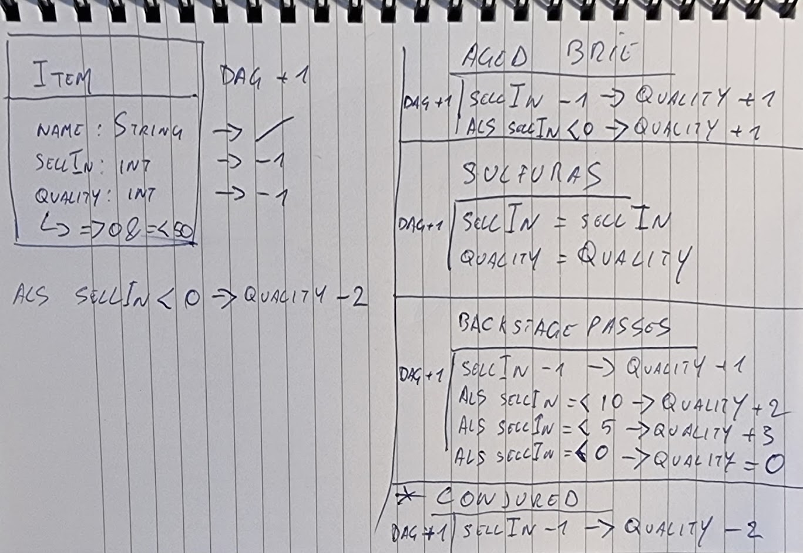

- Geforkt en git clone
- Geopende in IntelliJ, project op basis van Gradle file
- Run gradle clean build
    Test faalt -> staat in Requirements Specification. Ze liegen niet.
- Run gradle clean build -x test
    Build groen, want negeert testen.
- gradle file bekijken:
    Eerste opmerkingen:
        - Java 1.8 -> updaten naar LTS versie
        - Libraries updaten
        - Maven stuff verwijderen -> onnodige clutter.
- main directory eens bekeken
    - Lezen, wat gebeurt er.
    Eerste opmerkingen:
        - Van Item class en Items property afblijven (as per Requirements Specification -> boze goblin)
            Hierdoor ook geen getters en setters -> Extend? Extend.
        - Items en UpdateQuality mogen eventueel static (as per Requirements Specification)
        - Heeeeeel veel if's. Te veel.
            Soms ook if within an if die samengevoegd kan worden.
        - De for statement kan simpeler en duidelijker.
        - Item array?
        - items[i].quality - items[i].quality -> Whut?
        - if (! conditie) else -> omdraaien, negatie maakt het ingewikkelder
        - Duplicate text. Versimpelen of in een constant gooien.
- tests bekeken
    - GildedRoseTest is broken -> startpunt.
    - TexttestFixture -> voor een snelle start, maar gaan we negeren, want ik wil tonen dat ik ook testen kan schrijven.

- Doelen:
    - Code herschrijven/verbeteren/testen
    - Nieuwe functionaliteit implementeren

- Vereisten en condities:
  

- Wijzigingen maken aan
    - UpdateQuality method
    - alle nodige code
    - Afblijven:
        - Item class - DO NOT TOUCH
        - Items property - DO NOT TOUCh (mag eventueel static)

- Testen fixen
    - Simpel en bulky, gebaseerd op de TexttestFixture testclasse
    - Waarom? Omdat het duidelijk is, werkt en ik tijdens het refactoren van de productiecode ook de testen ga herschrijven. -> TDD
    - Opmerking: Indien "Aged Brie" sellIn kleiner is dan 0 verhoogt de kwaliteit met 2 ipv 1. De Requirements Specification zeggen
        dat de bestaande code correct is, dus ik zal het nu zo implementeren, maar dit zou ik normaal willen afchecken met de product owner,
        aangezien niet specifiek wordt omschreven dat de verhoging ook verdubbelt. Hetzelfde voor het feit dat er nog
        checks op sellIn en bijhorende kwaliteitswijzigingen worden gedaan nadat de sellIn waarde verlaagd werd. Ik ga er van uit
        dat dit gewenst gedrags is voor Backstage ("na het concert -> 0"), maar de rest zou ik willen afchecken.
    - Conjured item nog niet toegevoegd.

- Versies updaten
  - Java 1.8 -> 17 (vereist Gradle upgrade 6.5 -> 7.2)
    - Waarom?
      - Grote refactor is mogelijkheid om te upgraden
      - 17 is de huidige LTS versie en wordt al ondersteund door quasi alle belangrijke libraries
      - Leuke nieuwe opties, zoals records etc
  - junit-jupiter 5.6.2 -> 5.8.2

- Refactoren productiecde
    - Wat: If's wegwerken. Code leesbaarder en makkelijker uitbreidbaar maken.
        - Hoe? Rule Pattern. Erg geschikt voor 'online shop'-achtige code.
            https://medium.com/swlh/rules-pattern-1c59854547b -> A rule should contain the logic that dictates
                whether or not it can be applied to a target object and the logic that it should apply.
        - Hoe? TDD. Ik schrijf eerst de testen met representatieve scenario's.
            Vervolgens begin ik de code te implementeren.
    - Resultaat:
      - Propere GildedRose class
      - Makkelijk uitbreidbare RuleEngine
      - Duidelijke testen die geen dubbel werk doen, maar wel alles trachten af te testen
    - Opmerkingen:
      - Rule Engine gaat uit van een match ahv het begin van de naam. De items die onder NormalItemRule vallen hebben
            echter geen vaste naam en kunnen bijgevolg niet matchen. Het matchprocess herschreven zodat er een default
            is indien niets matcht.
      - De if's staan nu in de Rule apply methode. Dit is al een pak leesbaarder, maar kan misschien nog duidelijker.
      - Enorm veel herhaalde code met verschillende parameters in testen -> parametriseren?

